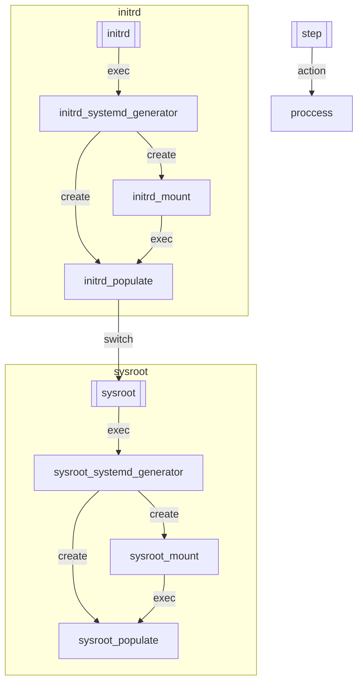

```mermaid
flowchart
  %% Legend
  step[[step]] -- action --> proccess

  subgraph a [initrd]
    initrd[[initrd]]

    initrd -- exec --> initrd_systemd_generator
    initrd_systemd_generator -- create --> initrd_mount
    initrd_systemd_generator -- create --> initrd_populate
    initrd_mount -- exec --> initrd_populate
  end

  subgraph b [sysroot]
    sysroot[[sysroot]]

    initrd_populate -- switch --> sysroot
    sysroot -- exec --> sysroot_systemd_generator
    sysroot_systemd_generator -- create --> sysroot_mount
    sysroot_systemd_generator -- create --> sysroot_populate
    sysroot_mount -- exec --> sysroot_populate
  end
```
