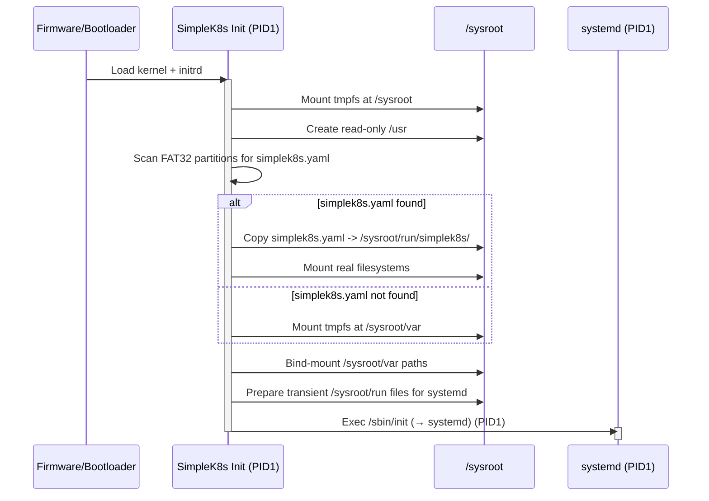
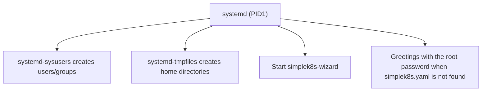

# Boot Sequence

This document describes the boot sequence of the **SimpleK8s Init** system.

---

## Overview

The boot sequence of SimpleK8s is divided into two main stages:

| Stage       | Description                                             |
| ----------- | ------------------------------------------------------- |
| **Initrd**  | Prepares the real sysroot. SimpleK8s Init as PID1.      |
| **Sysroot** | systemd takes over; users created and services started. |

---

## Initrd Stage

During this stage, the current system boots from a kernel-embedded temporary
root filesystem (initrd).

**SimpleK8s Init**, running as PID 1, performs the following actions:

### Sequence of Actions

### simplek8s.yaml

This file defines some system configurations, as mountpoints, users, groups,
files, directories, and links.
You can find more details about this file structure and its usage in the next
[simplek8s-yaml.md document](simplek8s-yaml.md).

SimpleK8s Init searches **all FAT32 partitions** for a `simplek8s.yaml`
configuration file in the next paths:

- `/`
- `/simplek8s/`
- `/EFI/`
- `/EFI/simplek8s/`
- `/boot/`
- `/boot/simplek8s/`
- `/boot/EFI/`
- `/boot/EFI/simplek8s/`

If it is found, the configuration file is copied to:
`/sysroot/run/simplek8s/simplek8s.yaml`.

### Bind-Mounted Directories

| From                                  | To                                |
| ------------------------------------- | --------------------------------- |
| `/sysroot/var/etc`                    | `/sysroot/etc`                    |
| `/sysroot/var/home`                   | `/sysroot/home`                   |
| `/sysroot/var/mnt`                    | `/sysroot/mnt`                    |
| `/sysroot/var/opt`                    | `/sysroot/opt`                    |
| `/sysroot/var/root`                   | `/sysroot/root`                   |
| `/sysroot/var/usr/libexec/kubernetes` | `/sysroot/usr/libexec/kubernetes` |
| `/sysroot/var/usr/local`              | `/sysroot/usr/local`              |

---

## Sysroot Stage

Once control transfers kernel PID1 to `/sbin/init` (normally a symlink to
`/usr/lib/systemd/systemd`), the **sysroot stage** begins.

### Sysroot Stage Overview

### Behavior Summary

| Component                | Purpose                                          |
| ------------------------ | ------------------------------------------------ |
| `systemd-sysusers`       | Creates users and groups from `simplek8s.yaml`.  |
| `systemd-tmpfiles`       | Creates home directories and runtime dirs.       |
| `simplek8s.yaml` missing | Show in the login banner the generated root pwd. |
| Core services            | Downloads and launches `simplek8s-wizard`.       |
